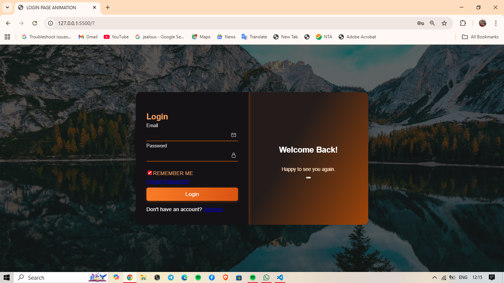

# 🔐 Animated Login Page | HTML, CSS & JavaScript

A modern *Animated Login Page* designed and developed by *Raunak Mishra*, featuring smooth UI transitions, a dark & orange gradient theme, and a scenic background image for a premium look.

---

## 🌟 Features

- 🎨 *Stylish UI Design* – Elegant dark and orange gradient combination  
- 🖼 *Beautiful Background Image* – Enhances visual appeal  
- 💫 *Smooth Animations* – Subtle motion effects for a modern touch  
- 🔑 *User-Friendly Form* – Includes Email, Password, and Remember Me  
- 📱 *Responsive Layout* – Works smoothly on all devices  
- 🔗 *Forgot Password & Register Links* – Fully functional placeholders  

---

## 🛠 Built With

- *HTML5* – Structure of the page  
- *CSS3* – Styling, gradients, and animations  
- *JavaScript (Optional)* – For future functionality or transitions  

---

## 📸 Preview

<p align="center">
  
</p>


---

## 🚀 How to Run

1. Clone the repository:
   ```bash
   git clone https://github.com/yourusername/animated-login-page.git

2. Open the project folder:

cd animated-login-page


3. Launch the page:

open index.html

(or just double-click the index.html file in your folder)


---

🧠 Author

👤 Raunak Mishra
💻 Tech Enthusiast | Creative Web Developer
📧 raunakmishrabxr@gmail.com


---

💖 Acknowledgements

Inspiration from modern UI/UX login forms

Background image sourced from royalty-free resources (Unsplash/Pexels)


---

📜 License

This project is open source and available under the MIT License.


---

⭐ If you like this project, don't forget to star the repository!

---

Would you like me to make it more *stylish with emojis and badges* (like GitHub profile style), or keep it *simple and professional*?
